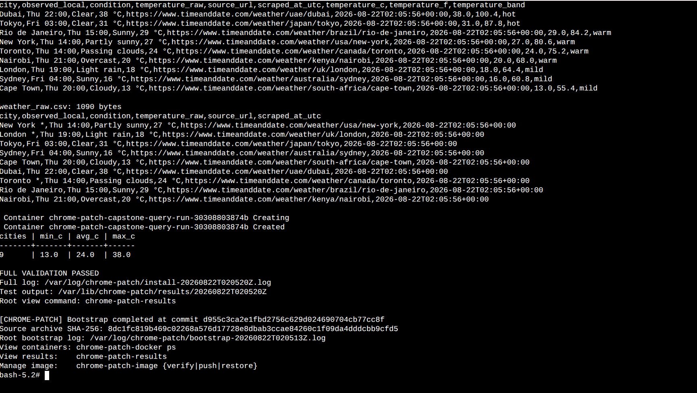

# Successful validation run `20260822T020520Z`

This bundle records the successful `--skip-build` validation completed on
2026-08-22 UTC using the already compiled, pinned Chromium runtime. The
application layer was refreshed, the security controls were audited, and both
coursework projects ran to completion.

## Immutable identity

| Item | Verified value |
| --- | --- |
| Runtime commit | `d955c3ca2e1fbd2756c629d024690704cb77cc8f` |
| Branch | `codex/hardened-assignment8-capstone` |
| Chromium | `151.0.7922.169` |
| ChromeDriver | `151.0.7922.169` |
| Selenium | `4.47.0` |
| Chromium source archive SHA-256 | `8dc1fc819b469c02268a576d17728e8dbab3ccae84260c1f09da4dddcbb9cfd5` |
| Immutable GHCR runtime | `ghcr.io/ornab74/chrome-patch-chromium@sha256:f212beff4487370a6c026a1834f779657e76c7091c6ae42b4d2cee8cfe42d2f3` |
| Screenshot SHA-256 | `bd05c54136979f0f2366776ab42904de65c4be36dcf0cf2c41e6602d298ab24a` |
| Terminal capture SHA-256 | `d2aaf11e80c967bc6faefebe2d56375184b9e4478a011f6c1ea618519fd911f6` |

The local application-refresh image ID shown in the terminal capture is not a
replacement for the immutable GHCR digest. It identifies the node-local image
after the current repository application layer was copied onto the verified
browser base.

## Security proof

The run passed the nested user-namespace preflight. Chromium then reported:

| Required control | Observed state |
| --- | --- |
| Layer 1 Sandbox | `Namespace` |
| PID namespaces | `Yes` |
| Network namespaces | `Yes` |
| Seccomp-BPF sandbox | `Yes` |
| Overall probe result | `You are adequately sandboxed.` |

The probe ran before the browser audit and again before the complete container
test stage. Both evaluations returned `"sandbox": "verified"`. The container
continued to use rootless Docker, the reviewed AppArmor profile, the reviewed
seccomp profile, a read-only root filesystem, dropped capabilities, and
`no-new-privileges`—without `--no-sandbox`, privileged mode, `SYS_ADMIN`, or a
global user-namespace relaxation.

## Test results

| Test layer | Result |
| --- | --- |
| Host-side repository security and unit tests | `26 passed` |
| Container test stage | `27 passed, 33 subtests passed` |
| Assignment 8 output verifier | `3 books, 10 unique OWASP risks` |
| Capstone output verifier | `9 fixture observations in CSV and SQLite` |
| Final installer status | `FULL VALIDATION PASSED` |

## Assignment 8 results

### Books

| Title | Author | Format and year |
| --- | --- | --- |
| Practice Makes Perfect: Complete Spanish Grammar | Gilda Nissenberg | Book, 2024 |
| Easy Spanish Step-by-Step | Barbara Bregstein | eBook, 2023 |
| Spanish Conversation | Jean Yates; Ana Lopez | Audiobook, 2022 |

The run generated `get_books.csv`, `get_books.json`, and `owasp_top_10.csv`.
The OWASP result contained ten unique 2025 risks, from A01 Broken Access
Control through A10 Mishandling of Exceptional Conditions. The exact CSV and
JSON output appears in [`captured-terminal.txt`](captured-terminal.txt).

## Capstone results

The pipeline wrote nine raw rows, nine clean rows, and nine SQLite rows. No
rows were removed during cleaning.

| City | Condition | Celsius | Fahrenheit | Band |
| --- | --- | ---: | ---: | --- |
| Dubai | Clear | 38.0 | 100.4 | hot |
| Tokyo | Clear | 31.0 | 87.8 | hot |
| Rio de Janeiro | Sunny | 29.0 | 84.2 | warm |
| New York | Partly sunny | 27.0 | 80.6 | warm |
| Toronto | Passing clouds | 24.0 | 75.2 | warm |
| Nairobi | Overcast | 20.0 | 68.0 | warm |
| London | Light rain | 18.0 | 64.4 | mild |
| Sydney | Sunny | 16.0 | 60.8 | mild |
| Cape Town | Cloudy | 13.0 | 55.4 | mild |

The final SQLite query returned:

| Cities | Minimum °C | Average °C | Maximum °C |
| ---: | ---: | ---: | ---: |
| 9 | 13.0 | 24.0 | 38.0 |

The captured run reports a 16,384-byte `weather.db`, a 1,253-byte
`weather_clean.csv`, a 1,090-byte `weather_raw.csv`, and a 59-byte
`cleaning_stats.json`. The terminal capture contains the complete displayed CSV
data and cleaning statistics. The database itself is not reconstructed from
screen output and is therefore not represented as if its original bytes were
available.

## Files in this bundle

- [`captured-terminal.txt`](captured-terminal.txt): verbatim text supplied from
  the completed installer log.
- [`full-validation.png`](full-validation.png): screenshot of the successful
  result/query section and final bootstrap identity.
- [`validation-summary.json`](validation-summary.json): machine-readable facts
  extracted from the two operator-supplied artifacts.

This is intentionally an evidence bundle, not a claim that documentation-only
commits after `d955c3ca` reran the DigitalOcean workload. Repository CI validates
the evidence hashes and documentation changes independently.
